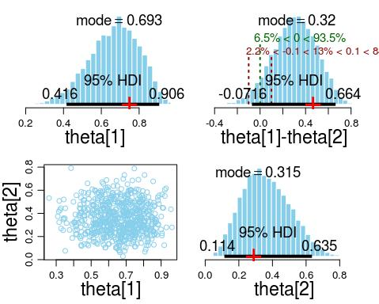

## Summary

This is an example report showing an MCMC simulation for the difference in biases for Bernoulli trials.

## Code for Bayes Analysis


```{r setup}
source("DBDA2E-utilities.R")
source("Jags-Ydich-XnomSsubj-MbernBeta.R")
```


```{r read_in}
### Read in the data
d <- read.csv("z6N8z2N7.csv")
y <- d$y
s <- as.numeric(d$s)
```


```{r structure}
### Bundle data into a list

Ntotal <- length(y)
Nsubj  <- length(unique(s))

dList <- list( y = y,
               s = s,
               Ntotal = Ntotal,
               Nsubj  = Nsubj )
```


### Specify model (check against TEMPmodel.txt)
model {
  for ( i in 1:Ntotal ) {
      y[i] ~ dbern( theta[s[i]] )
  }
  for ( s in 1:Nsubj ) {
      theta[s] ~ dbeta(2,2)
  }
}


```{r jags_run}
### High-level script for JAGS

mcmcCoda = genMCMC(data=dList, numSavedSteps=10000)
diagMCMC(mcmcCoda, parName="theta[2]")
smryMCMC(mcmcCoda, compVal=NULL, compValDiff=0.0)
plotMCMC(mcmcCoda, 
         data=dList, 
         compVal=NULL, 
         compValDiff=0.0, 
         ropeDiff=c(-0.1,0.1),
         saveName="TEMP.jpg", 
         saveType="jpg")


```



```{r frequentist_test}
### Test of proportions
table(d)
prop.test(x = c(6,2), n = c(8,7), correct=TRUE)
```


