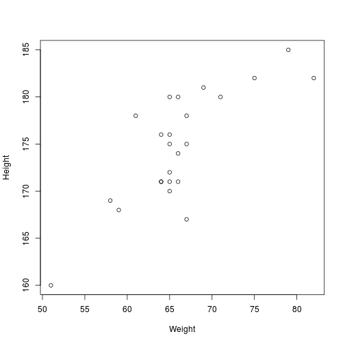

Quantitative Methods 1
========================================================
author: Doug Davidson
date: September 17, 2018
autosize: true


R basics
========================================================
- R syntax
- Packages in R
- Scripts and notebooks


Code example
========================================================


```r
d <- read.csv("motogp_height_weight.txt", header=TRUE)
summary(d)
```

```
     Rider        Weight          Height     
 Abr    : 1   Min.   :51.00   Min.   :160.0  
 AEsp   : 1   1st Qu.:64.00   1st Qu.:171.0  
 Bau    : 1   Median :65.00   Median :175.0  
 Cru    : 1   Mean   :66.08   Mean   :174.7  
 Dov    : 1   3rd Qu.:67.00   3rd Qu.:180.0  
 Ian    : 1   Max.   :82.00   Max.   :185.0  
 (Other):18                                  
```

Plot example
========================================================


```r
plot(Height~Weight, data=d)
```




Homework for 19-09-2019
========================================================

- Read in the dataset
- Create a plot of height versus weight
- Change the x- and y- axis labels to include units
- Change the main title
- Save the plot as a .pdf 
- Send it as an email


Statistics: Terms for uncertainty
========================================================

- Random
- Variability/variation
- Fuzziness
- Noise
- Probably /probability /probable /improbable
- Possibly /possible /possibility
- Plausibly /plausible

*M. Smith*


Distribution
========================================================

For a random variable, a *formula* that gives the probability of each value of the variable. 

If the variable is continuous, the formula describes a curve, and the areas falling *under* the curve give the probabilities within particular intervals.

*Cambridge Dictionary of Statistics*


Reducing uncertainty
========================================================

Some people would describe *uncertainty* as the precision of a measurement of some quantity.

Can uncertainty be reduced?  Increased?  

Can we quantify uncertainty?


Probability
========================================================

A measure associated with an event A and denoted by Pr(A) which takes a value such that:

0 <= Pr(A) <= 1.  

Colloquially: The chance that an event will occur.

Features: 

The higher the value of Pr(A), the more likely it will occur. If an event cannot happen then Pr(A) = 0.  If an event is certain, then Pr(A) = 1.

*Cambridge Dictionary of Statistics*


Sample 
========================================================

A selected subset of a population chosen by some process.  

Usually with the objective of investigating the properties of the population from which the sample is drawn.

*Cambridge Dictionary of Statistics*


Sample Space
========================================================

The set of all possible outcomes of an experiment.  

For example, if two coins are tossed, the sample space is the set of possible results:

- HH
- HT
- TH
- TT


*Cambridge Dictionary of Statistics*


